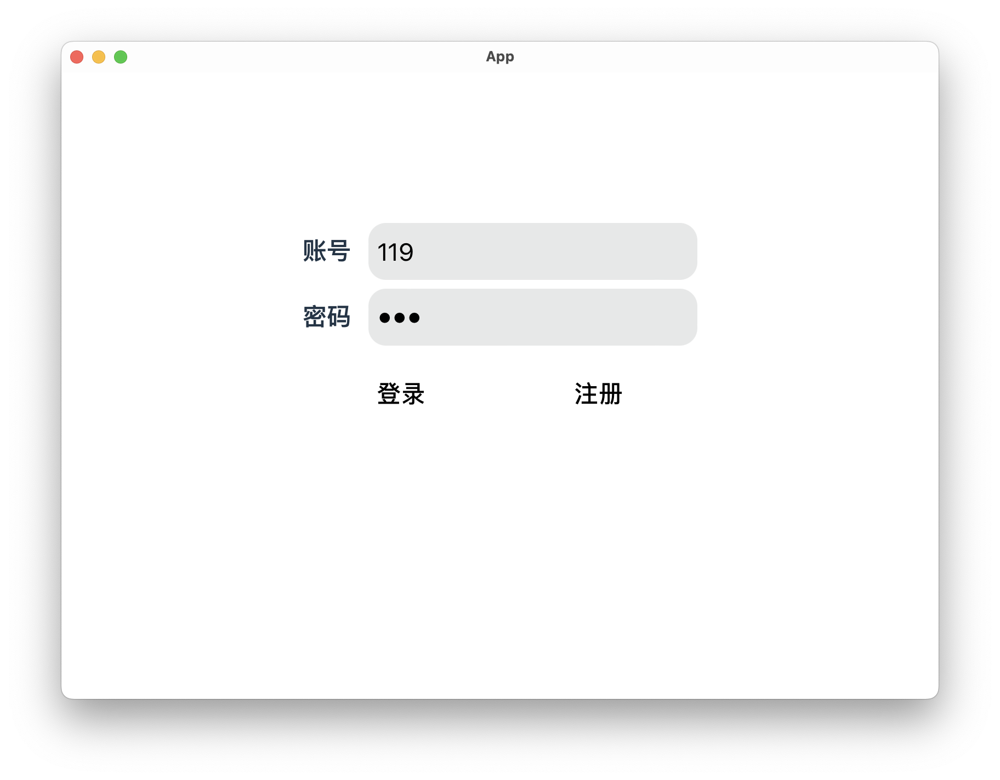
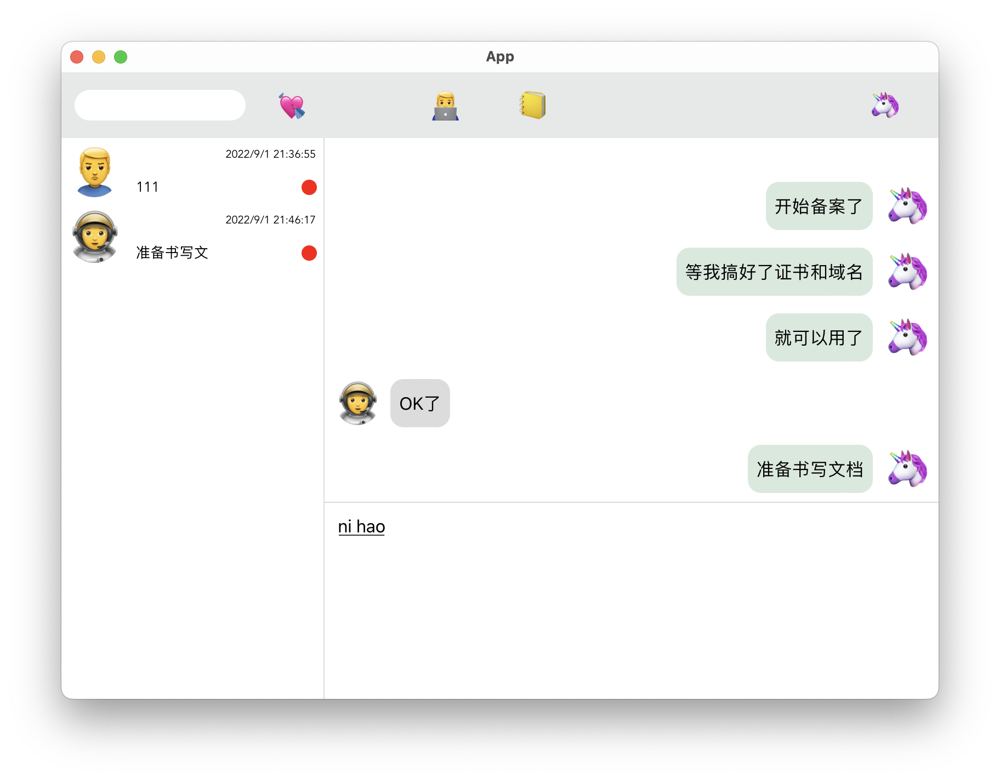
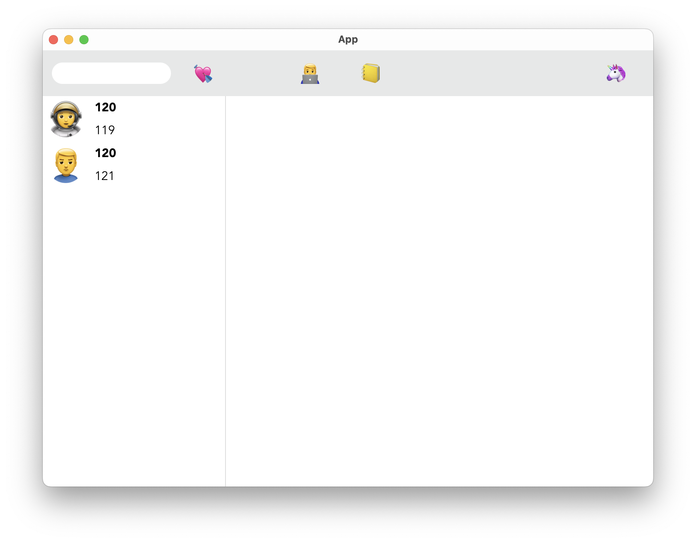

## Pure Rust Instant Message(PRIM)

### 概述

使用几乎纯Rust实现的即时通讯系统。

- 服务端：Rust
- 后端：Python
- 客户端：Rust+TS

关于后端选择Python的原因：

- Rust写业务有点不合适，效率低
- 公司转语言转到了Python

关于客户端，原本钦定了Electron+Vue3，后面看到Tauri(一个使用Rust实现的类似Electron的跨平台框架)；考虑到和服务端契合度以及代码可复用(偷懒了属于是)，所以切换到了这里。

#### 依赖

- ##### 数据库：PostGreSQL

- ##### NoSQL：Redis

### [系统架构](./doc/1.md)

### [细节实现](./doc/2.md)

### [客户端实现](./doc/3.md)

### 效果

#### 登录注册

#### 添加好友

#### 消息

#### 好友列表

### 代办

 - [ ] 撤回
 - [ ] 发送失败回执
 - [ ] 群聊
 - [ ] 发送文件，表情，图片，视频，音频
 - [ ] 服务端集群
 - [ ] 负载均衡，横向伸缩
