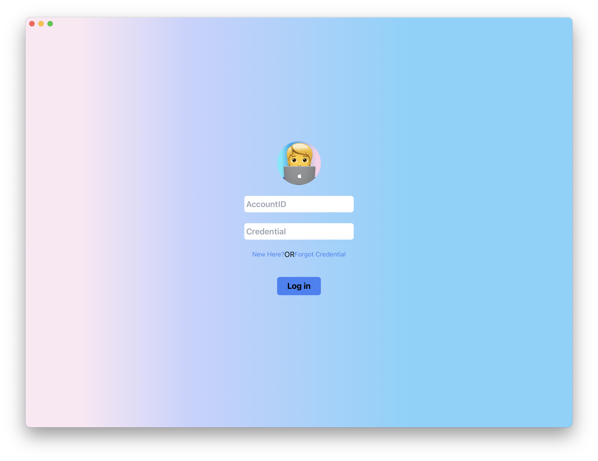
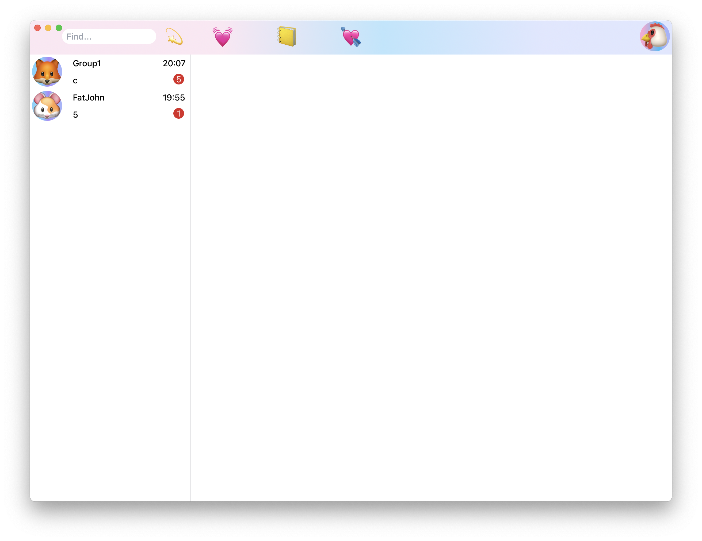
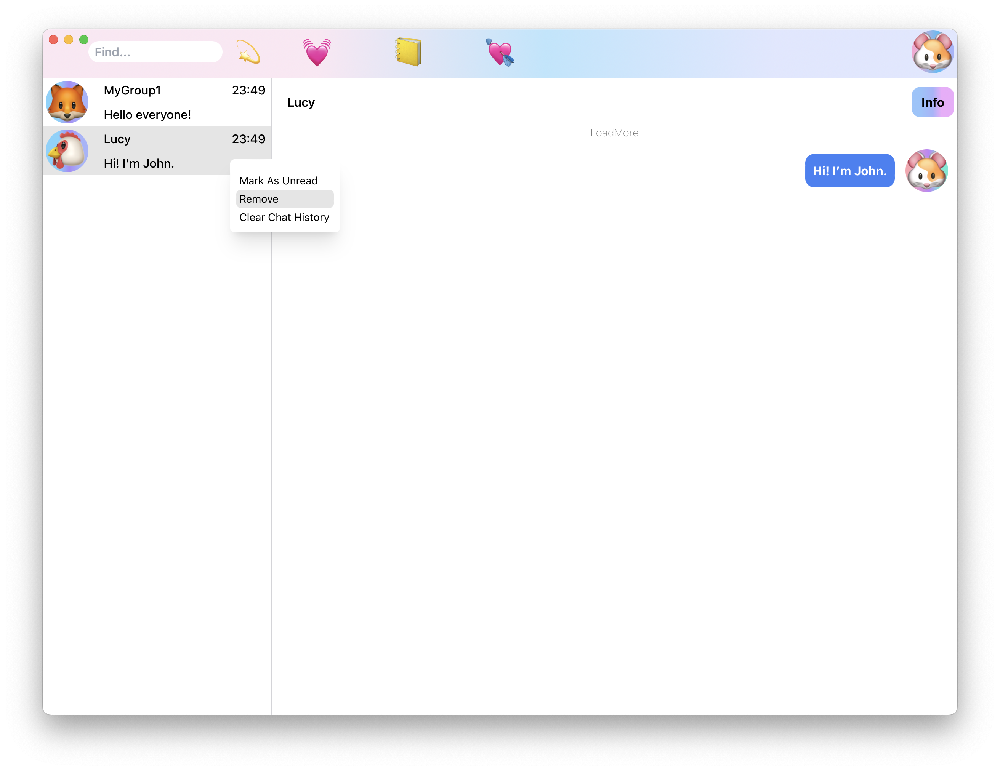
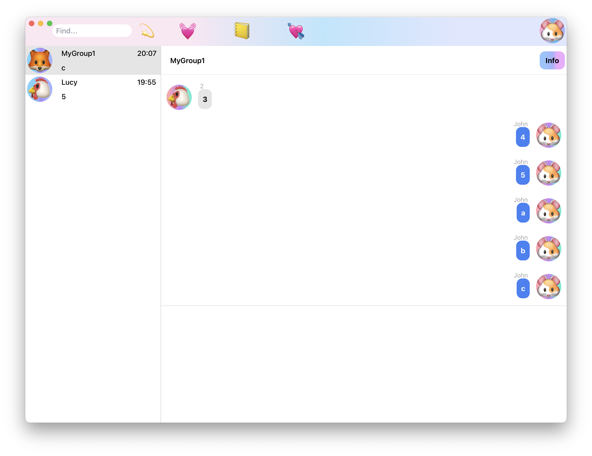
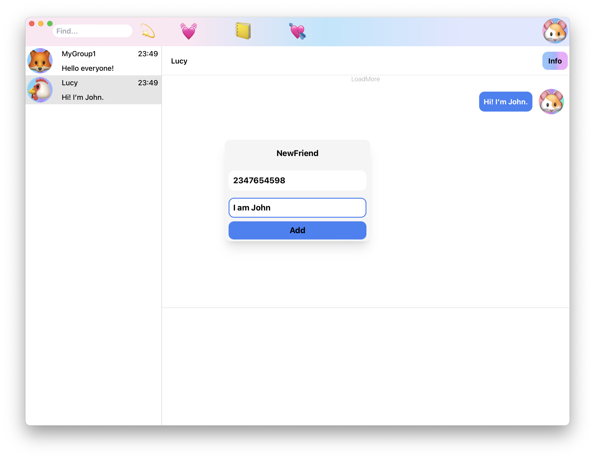
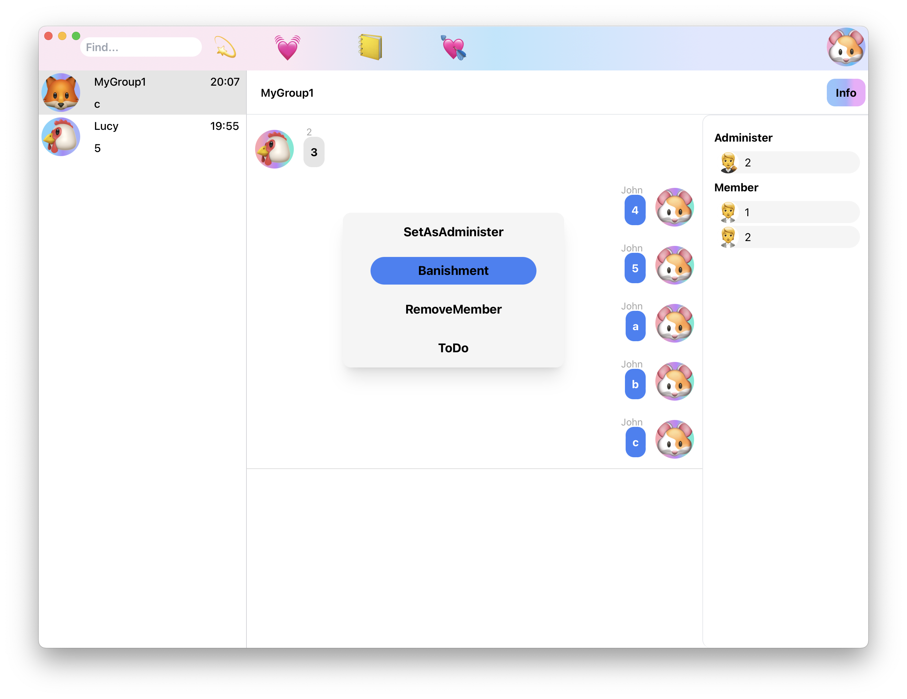
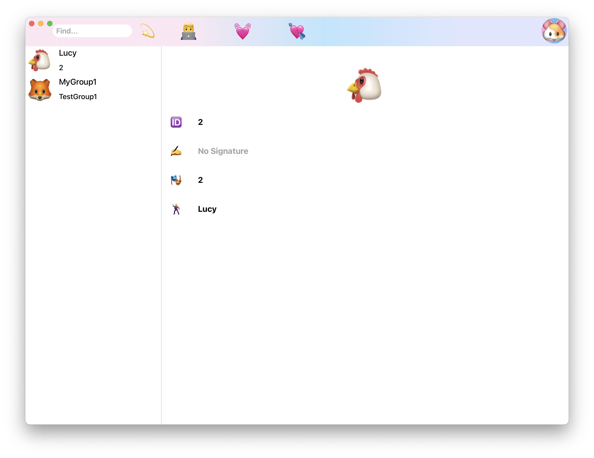

## Pure Rust Instant Message(PRIM)

### 概述

使用纯Rust实现的即时通讯系统。

- 服务端：Rust
- 后端：Rust
- 客户端：Rust+TS

关于客户端，原本钦定了Electron+Vue3，后面看到Tauri(一个使用Rust实现的类似Electron的跨平台框架)；考虑到和服务端契合度以及代码可复用(偷懒了属于是)，所以切换到了这里。

#### 依赖

- **Database：PostGreSQL**

- **NoSQL：Redis**

- **Web: Salvo**

- **RPC: Tonic**

- **HttpClient: Reqwest**

- **Core: QUIC**

- **Runtime: Tokio+Monoio**

### 效果

#### 登录注册

#### 主页面

#### 添加好友

#### 消息

#### 好友列表

### 快速开始

#### 环境依赖

此项目仅可以在Linux和MacOS运行，原因在于依赖的部分package无法在Windows使用，如果您想要在Windows尝试，可以使用Docker一键部署。

- Rust环境
- Yarn
- Postgresql
- Redis
- Kafka

#### 裸运行

- 执行server/redis-cluster/cmd.sh即可，如果出现报错可重试，一般即可启动一个三节点的Cluster模式的Redis集群。
- 执行server/kafka-cluster/cmd.sh即可，如果出现`no such file or directory`，手动复制粘贴指令即可，同时第一次运行请注释掉初始化目录的命令用以初始化log文件夹。
- 进入你的PostgreSql，创建一个新的用户，制定密码，给予其创建删除database的权限，然后使用此用户登录，执行server/apt/init.sql即可。上述操作可通过PgAdmin图形界面完成，或通过DataGrip完成。
- 执行server/cert/tls.sh，生成开发证书，这里你需要输入参数`localhost`指出证书的域名且表示这仅用在本地开发。

至此，你已拥有了基本的运行环境。

##### 配置文件

更改：

- api
- message
- scheduler
- seqnum

之下的`config-example.toml`名称为`config.toml`并更改里面对应的配置即可，一般为数据库，Redis，Kafka，证书文件地址。

你可能会注意到这里还有`msgprocessor`项目，并且它没有配置文件，此项目还在开发中，它会作为消息处理下游服务，执行持久化，推送系统接入等操作，但不影响目前本地启动。

##### 客户端配置

类似服务端配置，处理证书文件位置即可，这里需要注意的是，如果选用打包运行，需要反注释掉`main.rs`中载入资源文件的代码。

##### 额外的注意事项

`seqnum`和`msglogger`使用了`monoio`作为运行时，因此需要使用nightly版本，随着后续GAT的稳定，此要求将被取消。

#### Docker运行

根据系统架构，选择`aarch64`/`amd64`执行`docker-compose-aarch64/amd64.yaml`即可。

compose会自动拉起一个kafka，一个redis集群，一个postgresql以及对应的四个模块(msglogger嵌套在message中运行)。

### [系统架构](./doc/1.md)

### [细节实现](./doc/2.md)

### [客户端实现](./doc/3.md)

### 待办

因为时间和精力因素，部分功能还在开发中，且对应API已开发完毕，等待客户端整合，这些功能包括但不限于：

 - [ ] 发送文件，表情，图片，视频，音频
 - [ ] 消息数据库持久化(为了快速开发目前仅存储在开启了持久化的Redis中)
 - [ ] HTTP3开启
 - [ ] 客户端消息乱序，丢失监测机制

### 联系方式

如果你对此项目感兴趣，或许想要了解详细的实现(因为时间和精力，文档会有所欠缺)。可以通过以下方式联系我：

- 📧Mail：jokerblack2508826394@gmail.com
- 🐧QQ：2508826394

本项目遵循**MIT**开源许可。
