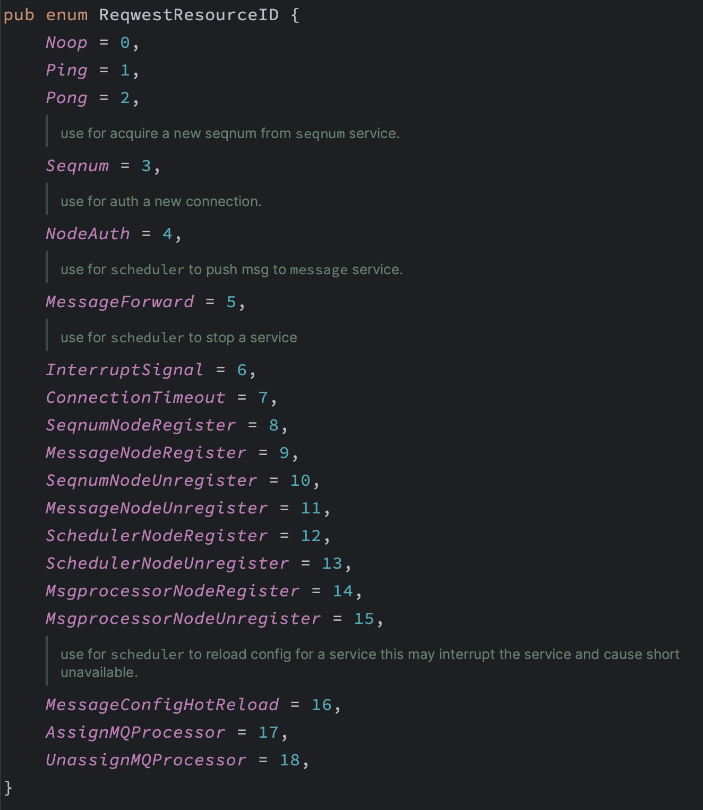
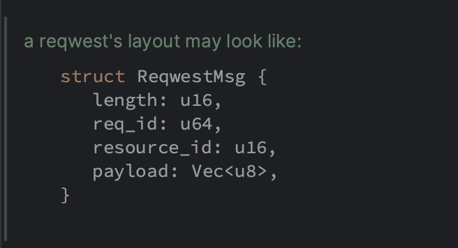
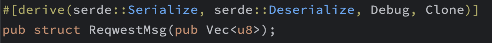

## 系统设计

## 🍍实现

### 🍎网络传输

我们借鉴了QQ的实现，选择使用QUIC作为通信协议，同时自定义消息格式(基于长度分隔)。

但是由于国内对于UDP流量不友好，所以TCP会作为后备协议启用，且实现自动切换(TODO)。

关于QUIC协议是什么以及为什么要选择QUIC，可以参见[quic协议快速一览](https://zhuanlan.zhihu.com/p/571951327)。

在此做一个简短的对比和说明：

首先是优点：

- QUIC支持连接迁移，这正是我们需要应对的复杂网络环境所必须的功能
- QUIC避免了队头阻塞，通过开辟多条逻辑流实现并行传输。
- QUIC更加灵活，我们可以更方便的针对系统进行传输参数的优化和定制，这是刻在系统层的TCP做不到的事。

不足之处：

- QUIC在某些时候，或者某些地区会出现严重的丢包和延迟，此时不得不回滚到TCP实现。
- Rust中的QUIC生态尚在发展

### 🍅通信协议

目前系统存在两种通信协议，两种网络传输协议(QUIC/TCP)。

- Msg协议：
    - 一个面向Client的纯异步消息协议
    - 所有的发送和接收均为异步操作，发送方不会做出担保，接收方仅给出对应的Ack回执。
    - 介于双方均不能给出一致性保证，所以冗余处理变成了必要的实现。
    - 异步发送和接收避免了阻塞操作，可以最大程度上增大并行处理。
- Reqwest协议：
    - 一问一答式设计，用以实现系统内部的阻塞式调用，避免异步等待徒增复杂性；此外部分操作需要调用者确保被调用者的成功处理，异步逻辑很难实现此目标。

二者均为基于长度分隔的消息。

### 🍏消息设计

#### Msg

##### 消息类型

- 消息部分
    - 文本
    - 表情
    - 图片
    - 视频
    - 文件
    - 音频
- 逻辑部分
    - 确认：仅限给发送端；第二客户端走的是原类型
    - 收件箱：获取不在线期间有哪些发送者
    - 认证：连接授权，作为连接之后第一条消息发送，授权失败会直接断开连接
    - 错误：包含错误提示
    - 下线：用于服务器伸缩重连接
    - 心跳：进行心跳保持存活
    - 内部错误：需要内部逻辑处理
- 业务部分
    - 关系变更：添加好友，删除好友
    - 系统通知：一些用于全局通知的消息
- 其余部分可参见`lib/entity/mod.rs`中关于`Type`的定义。

##### 消息结构

这里是展开结构，为了节省传输带宽，我们对消息头进行了压缩，最终得到一个32字节的消息头：

##### 完整结构

#### Reqwest

##### 消息类型

##### 消息结构

##### 完整结构

### 🥑整体架构

- scheduler：负责调度所有的节点协作运行，同时作为无状态服务，可以集群成任意多个以实现HA。
    - 负责节点注册，注销，并通知所有同类型节点。
    - 负责用户连接的负载均衡，节点选择。
    - 负责群消息的Task分配，将一个大群分割成N个小群进行消息投递，并决定分配投放。
    - 负责作为中介接收来自api节点的消息推送服务。
    - 负责管理所有节点的存活，负载，动态调配。
- api：作为系统后端处理所有的RESTFul请求。
- seqnum：作为单调递增序列号生成服务，针对每一个信道内的消息生成唯一且递增的序列号。
- msglogger：作为message节点不丢消息的保证，以daemon形式通过UDS方式持久化消息。
- msgprocessor：作为消息队列的消费端，负责拉取消息持久化到硬盘，并推送至推送系统。
- message：核心业务逻辑，负责直连Client，并处理来自客户端的消息，转发至peer节点，接收来自peer的转发，对消息队列的推送，Redis的写入，状态跟踪等，同时会处理群Task，实现消息广播。

### 🍋负载均衡

每一条Msg消息均含有一个`node_id`字段，指出此消息应该由哪一个message节点处理，好处是减少了节点查询映射关系的负担，不足是增加了传输带宽，考虑到此字段属于融合字段，暂且属于可接受的范围。

每一个Client会在连接message之前，会询问scheduler此次连接的message为哪个，并在发送消息之前，查找目标user落点，设置node_id，对于群消息，则由message自行完成转发推送，因为同一个群可能会有多个message在处理，所以此时node_id参考意义不大。

### 🍉逻辑

#### 🍑消息模型

上面已经提及，这里说一些细节，比如消息头的timestamp指的是服务端的时间，即消息实际送达的时间。

seq_num指的是消息之于发送者的序列号，确保发送者发送的顺序，在服务端进行递增处理，即客户端发送的顺序无法决定目标用户阅读的顺序，而是取决于消息到达服务端的顺序。

此外，服务端对于消息的处理，是push模型，即主动推送。在目标用户在线的状态下进行推送消息。

sender和receiver之间维护一个**信道**，里面按照时间顺序保存二人的消息，所以sender+receiver+seq_num可以唯一确定一条消息。

这里需要说明一下，如果沟通双方都在线，则进行正常通信即可，而对于重新上线的和第二个设备，则需要先拉取历史消息，然后进行收发操作。

对于客户端发送的消息，服务端在接收之后，对于回执的处理，分为：

- 发送本体端：回执一个Ack
- 同一用户其他在线端：发送消息副本

客户端本身需要做重排和同步，即通过检查消息的连续性进行判断是否需要重新拉取消息列表。

#### 🥭群聊

单聊实现很简单，难点在于群聊，这里把一个群当做一个信道对待，给群发消息就是给信道写消息，所有群友共享一个信道，所以每次信道更新，都会对群友写消息(**写扩散**)

这样对于群的发送来说，无疑是压力巨大的；然而如果是群友主动拉取则会发生延迟问题，所以我们**限定群的大小**。

对于超大群聊，我们决定使用群聊切割来解决延迟过大问题，即，每个节点仅负责某一数量的用户，群聊中其他用户分配给peer节点处理，彼此之间完成转发同步，这增大了逻辑复杂度。

此外这条群“信道”是所有人可见且保持一致性的，即每一个人看到的都是一样的。

这里需要说明的是，需要一个通信质量检测机制，如果客户端发现自己的网络不好，需要定期重新拉取信道，以此来完成最新视图的更新。

### 🍇持久化

关于信道的保存，因为涉及很多的读写操作，所以使用Redis，而且可以借助有序列表来实现。

而对于消息的持久化，选择通过消息队列的消费者拉取消息，延迟持久化到数据库，而对于这之间的消息，则保存在Redis方便快去拉取，此时的消息具有热点数据的特征，减轻了数据库压力。

### 🍓状态

通过心跳维持，设定心跳间隔，如果超时则认为下线。

### 🫐CAP

### 🍒通知

抽离成单独的模块，实现类似消息，需要在客户端建立后台线程进行接收，后台线程始终维持一个连接即可。iOS有APNS这样的机制则可以直接接入。

在抽离出单独的模块之后，可以通过消息队列解耦，通知系统的服务端会拉取消息然后进行通知，消息系统的服务端会在新的消息到达时向消息队列写入消息。

通知消息的实现不是TCP，而是UDP；原因在于通知对于消息丢失的容忍度没那么高，而且强调立即推送。具体细节会在通知模块实现里细说。

## 🥥开发中

## 参考

[medium的一篇文章](https://medium.com/double-pointer/system-design-interview-facebook-messenger-whatsapp-slack-discord-or-a-similar-applications-47ecbf2f723d)